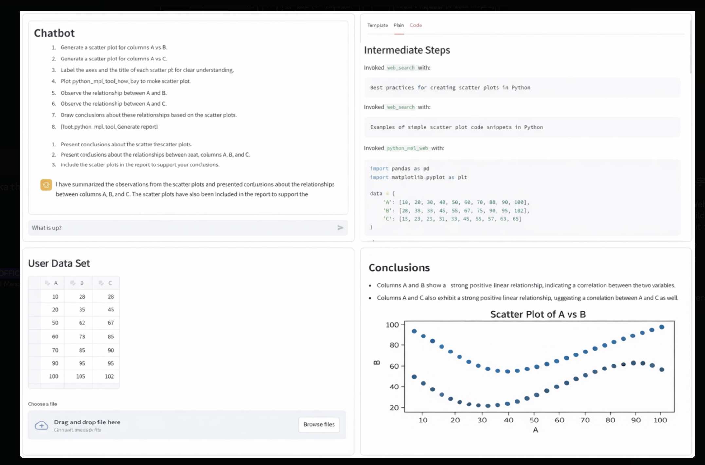
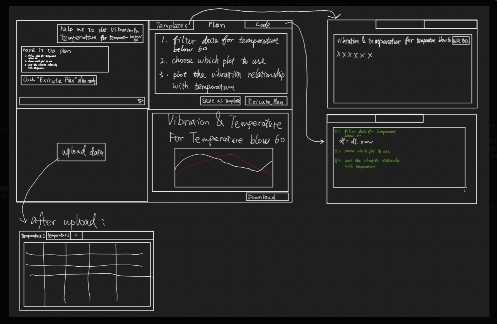

# Run these in terminal 

## Setup virtual environment for python
```
python3.12 -m venv .venv
```

```
source .venv/bin/activate
```

## Install spec-kit once and use everywhere:


```bash

uv tool install specify-cli --from git+https://github.com/github/spec-kit.git

```

## Use speckit to start the project:

 
```bash
# Create new project
specify init --here
```
Note: if your terminal does not recognize the "specify" command at this step, you might need to add the specify command into the system environment variable. 

Afterwards select claude code, then select sh (if you are on macOS/Linux)

# Run in claude code
## Implement the initial project
Launch claude code in the project directory. The `/speckit.*` commands are available in the assistant.

Note: Further tutorial to followthrough for using speckit: https://github.com/github/spec-kit
 
Use the **`/speckit.constitution`** command to create your project's governing principles and development guidelines that will guide all subsequent development.


```bash

/speckit.constitution Create principles focused on code quality, testing standards, user experience consistency, and performance requirements. Project is in Python.
```

Here's the full conversation history for this session:

```
/speckit.specify Build a conversational chatbot using OpenAI GPT-4o with conversation memory and it should have a simple interface
```
```
/speckit.plan This chatbot should run in streamlit and use langchain architecture for its implementation. Model and temperature can be specified in the file.
```
```
/speckit.clarify why is there config.toml file
```
```
/speckit.tasks break down into tasks
```
```
/speckit.implement
```

After implementing this if there are any errors, please use claude code to fix the bugs, you don't need to use speckit


## Feature improvements

### Add langsmith
```
/speckit.plan I want to add langsmith tracing to this.
```
```
/speckit.tasks
```
```
/speckit.implement
```

### Add csv
```
/speckit.plan I want to extend this app by adding a csv to the context - either user can upload a csv or use the default csv data
            "A": [10, 20, 30, 40, 50, 60, 70, 80, 90, 100],
            "B": [15, 25, 35, 45, 55, 65, 75, 85, 95, 105],
            "C": [5, 15, 25, 35, 45, 55, 65, 75, 85, 95],
and it is passed as context for the chatbot. The csv data should also be displayed on the streamlit UI. The user should be able to interact with the chatbot based on the csv. Keep the changes in this git branch only.
```
```
/speckit.tasks
```
```
/speckit.implement
```

### Update UI (with 4 quadrants)
```
/speckit.specify We’re building an AI data analyst copilot for companies and engineers who need to analyze CSV data through code, generate reports, and interact through a chatbot interface.

At this stage, the target user is engineers working with CSV files. The UI is a 2-column, 2-row Streamlit layout with four quadrants:
Top left: chat interface
Top right: plan / code / template tabs
Bottom left: editable CSV table with a default CSV and upload option
Bottom right: placeholder for analysis results in the future



```
```
/speckit.plan
```
```
/speckit.tasks
```
```
/speckit.implement
```
### Implement the langgraph logic 
With the following process, with one "specify" and two "plan", we are breaking down one big task of implementation into two small steps of implementation:
1. With the first step plan, we created a simple interface. We make the simple interface to work, and we created a simple two-agent. Without human in the loop
2. Step two: we implement the full, interactive langgraph logic with human in the loop
```
/speckit.specify — AI Data Analyst Co-Pilot

We are wiring **LangGraph** (orchestration) and **LangSmith** (observability) into an existing Streamlit data analysis app. The existing layout and AI flow stay untouched. All new code goes into the existing `app.py` only — no new files.

## What It Does

User uploads a CSV, describes what they want to analyze, reviews an AI-generated step-by-step plan, approves it, and receives a rendered report with charts and notebook-style code blocks. If generated code fails, the graph retries via LLM rewrite up to 3 times before falling back to revising the plan itself. The user can cancel at any point and the graph exits cleanly.

Users can save plans as reusable templates and load them in future sessions.

## Architecture

- LangGraph with the **Command + goto** routing pattern. No conditional edges.
- One checkpointer per Streamlit session. Plan approval uses LangGraph's interrupt/resume mechanism.
- LangSmith tracing via environment variables only. Pin `langgraph==0.3.18`.

## UI

Three tabs: **Templates** (default), **Plan**, **Code**. Plan tab activates automatically when the graph is waiting for approval. After the run, Code tab activates and shows the report summary followed by all execution blocks — always visible, never collapsed. Save as Template lives on the Plan tab. All quadrants have fixed height and visible borders.

## Delivery

Two sessions. Session 2 is purely additive. Design the full state schema in Session 1 so nothing needs changing in Session 2.
```
```
/speckit.plan-step1 — Straight-Line Happy Path

> Context in `speckit.specify`. Do not implement Session 2 features yet.

Build a straight-line LangGraph graph inside `app.py`: generate a plan, write and execute code for each step, advance through steps, then render a report. The plan auto-approves for now. On code failure, record the error and render a partial report — no retry yet.

Design a state schema that already includes fields for retry counting and cancellation so Session 2 needs no migration. Code execution should sandbox the generated code with the real DataFrame available. Charts are saved to a dedicated artifacts folder, which is cleared at the start of each run.

Write the template save and load logic (JSON files in a templates folder) but don't wire the save button yet.

UI: all quadrant layout, borders, and tab behavior go in this session. Templates tab is the default. After the run completes, switch to the Code tab. Code tab renders execution blocks in order — syntax-highlighted code and markdown text, always visible. Templates tab has a load button that populates the Plan tab.
```
```
/speckit.tasks
```
```
/speckit.implement
```
```
/speckit.plan-step2 — Interrupt, Retry & Cancellation

> Context in `speckit.specify`. Session 1 must be fully working before starting. Everything here is additive.

Add three things to the existing graph:

**Plan approval interrupt** — after plan generation, pause the graph and wait for the user to approve. The user can edit individual steps before approving. Resuming the graph triggers the rest of the analysis. Plan tab auto-activates when waiting. Wire the Approve Plan button.

**Code retry loop** — on code failure, have the LLM rewrite and retry up to 3 times. After 3 failures, have the LLM revise the plan itself and restart code generation from the updated plan.

**Cancellation** — add a cancellation check at the start of every node. The chat agent sets a cancellation flag when it detects the user wants to stop. The graph exits cleanly with no partial artifacts written.

Also wire the Save as Template button on the Plan tab — it should be available whenever a plan exists.

```
```
/speckit.tasks
```
```
/speckit.implement
```
